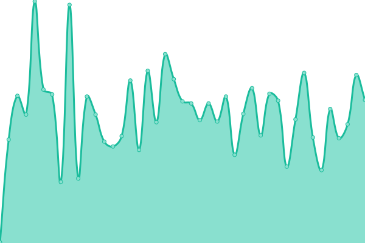
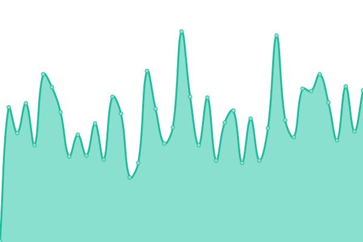
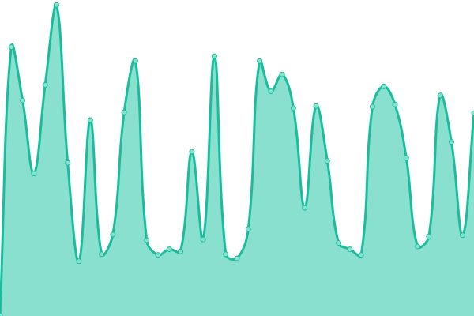
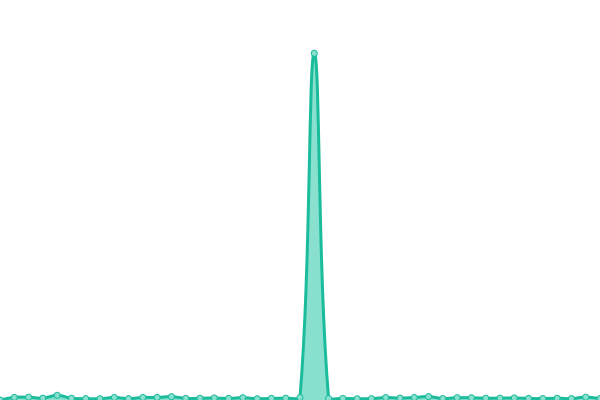
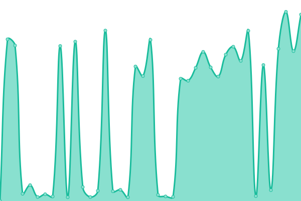
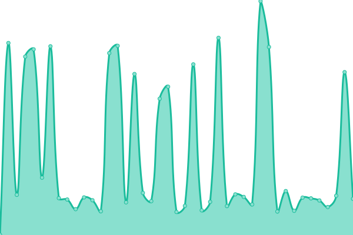
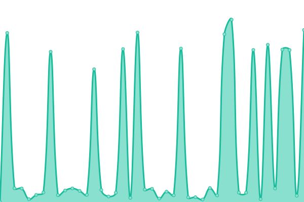
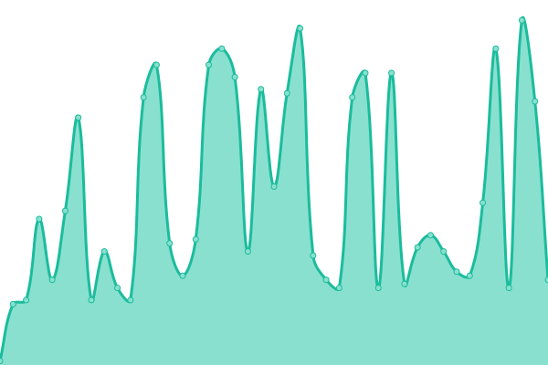
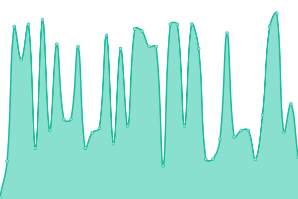

# 📡 🌊 Waveful Status Dashboard

This repository contains the open-source uptime monitor and status page for [Waveful](https://waveful.app), powered by [Upptime](https://github.com/upptime/upptime).

[Upptime](https://github.com/upptime/upptime) uses [GitHub Issues](https://github.com/Waveful/status.Waveful.github.io/issues) as incident reports, [GitHub Actions](https://github.com/Waveful/status.Waveful.github.io/actions) as uptime monitors, and [GitHub Pages](https://status.waveful.com) for the status page.

<!--start: status pages-->
<!-- This summary is generated by Upptime (https://github.com/upptime/upptime) -->
<!-- Do not edit this manually, your changes will be overwritten -->
<!-- prettier-ignore -->
| URL | Status | History | Response Time | Uptime |
| --- | ------ | ------- | ------------- | ------ |
|  [Website #1 (waveful.com)](https://waveful.com) | 🟩 Up | [website-1-waveful-com.yml](https://github.com/Waveful/waveful_status/commits/HEAD/history/website-1-waveful-com.yml) | 

 173ms
     
 | 

<a href="https://status.waveful.com/history/website-1-waveful-com">100.00%</a>
    

|  [Website #2 (waveful.app)](https://waveful.app) | 🟩 Up | [website-2-waveful-app.yml](https://github.com/Waveful/waveful_status/commits/HEAD/history/website-2-waveful-app.yml) | 

 157ms
     
 | 

<a href="https://status.waveful.com/history/website-2-waveful-app">100.00%</a>
    

|  [Website #3 (waveful.me)](https://waveful.me) | 🟩 Up | [website-3-waveful-me.yml](https://github.com/Waveful/waveful_status/commits/HEAD/history/website-3-waveful-me.yml) | 

 197ms
     
 | 

<a href="https://status.waveful.com/history/website-3-waveful-me">100.00%</a>
    

|  Content Delivery Network (cdn.waveful.app) | 🟩 Up | [content-delivery-network-cdn-waveful-app.yml](https://github.com/Waveful/waveful_status/commits/HEAD/history/content-delivery-network-cdn-waveful-app.yml) | 

 130ms
     
 | 

<a href="https://status.waveful.com/history/content-delivery-network-cdn-waveful-app">100.00%</a>
    

|  Functions Service | 🟩 Up | [functions-service.yml](https://github.com/Waveful/waveful_status/commits/HEAD/history/functions-service.yml) | 

 413ms
     
 | 

<a href="https://status.waveful.com/history/functions-service">100.00%</a>
    

|  Authentication Service | 🟩 Up | [authentication-service.yml](https://github.com/Waveful/waveful_status/commits/HEAD/history/authentication-service.yml) | 

 290ms
     
 | 

<a href="https://status.waveful.com/history/authentication-service">100.00%</a>
    

|  NoSQL Database #1 | 🟩 Up | [no-sql-database-1.yml](https://github.com/Waveful/waveful_status/commits/HEAD/history/no-sql-database-1.yml) | 

 704ms
     
 | 

<a href="https://status.waveful.com/history/no-sql-database-1">100.00%</a>
    

|  In-Memory Database #1 | 🟩 Up | [in-memory-database-1.yml](https://github.com/Waveful/waveful_status/commits/HEAD/history/in-memory-database-1.yml) | 

 244ms
     
 | 

<a href="https://status.waveful.com/history/in-memory-database-1">100.00%</a>
    

|  In-Memory Database #2 | 🟩 Up | [in-memory-database-2.yml](https://github.com/Waveful/waveful_status/commits/HEAD/history/in-memory-database-2.yml) | 

 214ms
     
 | 

<a href="https://status.waveful.com/history/in-memory-database-2">100.00%</a>
    

<!--end: status pages-->

[**Visit the status website →**](https://status.waveful.com)

## 📄 License

- Powered by: [Upptime](https://github.com/upptime/upptime)
- Data in the `./history` directory: [Open Database License](https://opendatacommons.org/licenses/odbl/1-0/)
