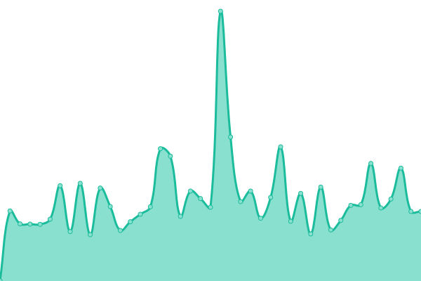
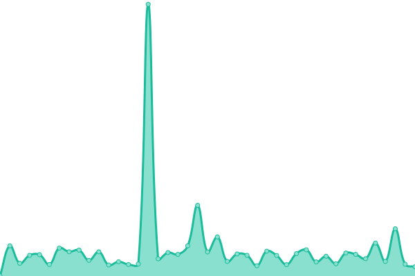
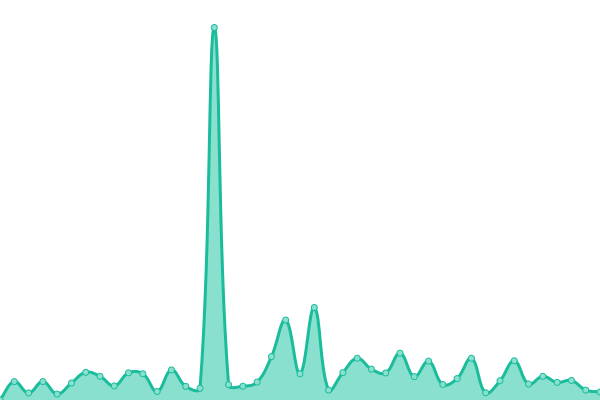

# 📡 🌊 Waveful Status Dashboard

This repository contains the open-source uptime monitor and status page for [Waveful](https://waveful.app), powered by [Upptime](https://github.com/upptime/upptime).

[Upptime](https://github.com/upptime/upptime) uses [GitHub Issues](https://github.com/Waveful/status.Waveful.github.io/issues) as incident reports, [GitHub Actions](https://github.com/Waveful/status.Waveful.github.io/actions) as uptime monitors, and [GitHub Pages](https://status.waveful.app) for the status page.

<!--start: status pages-->
<!-- This summary is generated by Upptime (https://github.com/upptime/upptime) -->
<!-- Do not edit this manually, your changes will be overwritten -->
<!-- prettier-ignore -->
| URL | Status | History | Response Time | Uptime |
| --- | ------ | ------- | ------------- | ------ |
|  [Website (waveful.app)](https://waveful.app) | 🟩 Up | [website-waveful-app.yml](https://github.com/Waveful/status.Waveful.github.io/commits/HEAD/history/website-waveful-app.yml) | 

 177ms
     
 | 

<a href="https://status.waveful.app/history/website-waveful-app">100.00%</a>
    

|  Content Delivery Network (cdn.waveful.app) | 🟩 Up | [content-delivery-network-cdn-waveful-app.yml](https://github.com/Waveful/status.Waveful.github.io/commits/HEAD/history/content-delivery-network-cdn-waveful-app.yml) | 

 120ms
     
 | 

<a href="https://status.waveful.app/history/content-delivery-network-cdn-waveful-app">100.00%</a>
    

|  Functions Service | 🟩 Up | [functions-service.yml](https://github.com/Waveful/status.Waveful.github.io/commits/HEAD/history/functions-service.yml) | 

 156ms
     
 | 

<a href="https://status.waveful.app/history/functions-service">100.00%</a>
    

|  Authentication Service | 🟩 Up | [authentication-service.yml](https://github.com/Waveful/status.Waveful.github.io/commits/HEAD/history/authentication-service.yml) | 

 353ms
     
 | 

<a href="https://status.waveful.app/history/authentication-service">100.00%</a>
    

|  NoSQL Database #1 | 🟩 Up | [no-sql-database-1.yml](https://github.com/Waveful/status.Waveful.github.io/commits/HEAD/history/no-sql-database-1.yml) | 

 1692ms
     
 | 

<a href="https://status.waveful.app/history/no-sql-database-1">100.00%</a>
    

|  In-Memory Database #1 | 🟩 Up | [in-memory-database-1.yml](https://github.com/Waveful/status.Waveful.github.io/commits/HEAD/history/in-memory-database-1.yml) | 

 147ms
     
 | 

<a href="https://status.waveful.app/history/in-memory-database-1">100.00%</a>
    

<!--end: status pages-->

[**Visit the status website →**](https://status.waveful.app)

## 📄 License

- Powered by: [Upptime](https://github.com/upptime/upptime)
- Data in the `./history` directory: [Open Database License](https://opendatacommons.org/licenses/odbl/1-0/)
